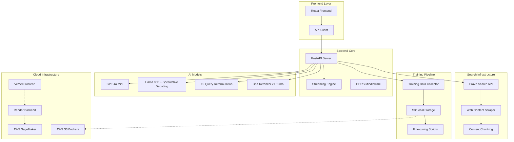

# 🔍 Zerplexity: Advanced AI-Powered Search Framework

[](https://zerplexity-5.onrender.com)
[](https://frontend-d8i6v1a7n-ayush-sharmas-projects-e00bb95e.vercel.app)
[](https://python.org)
[](https://reactjs.org)

**Zerplexity** is a next-generation internet search assistant that combines cutting-edge AI models with sophisticated training data collection to deliver high-quality, citation-rich responses. Built as a comprehensive framework for real-time model evaluation and fine-tuning in production environments.

## 🎯 Project Overview & Motivation

### **What is Zerplexity?**

Zerplexity is not just another search assistant—it's a **comprehensive research framework** designed for AI practitioners, researchers, and organizations who want to:

- **Experiment with different AI models** in real-world search scenarios
- **Collect high-quality training data** from actual user interactions
- **Fine-tune models** for improved search, ranking, and response generation
- **Compare model performance** across latency, quality, and user preference metrics

### **Core Functionality**

#### **🔄 Dual-Mode Operation**

**Production Mode**: Optimized single-response generation for real-world usage
- Single model response with optimized parameters
- Comprehensive performance metrics (latency, TTFT, tokens/min)
- Production-ready streaming with citation support

**Training Mode**: Side-by-side model comparison for continuous improvement
- **Simultaneous dual responses** with different temperatures (0.3 vs 0.7)
- **A/B testing interface** for user preference collection
- **Source ranking system** for reranker training data
- **Query effectiveness tracking** for query rewriting improvements

#### **🧠 Advanced Model Integration**

**Response Generation Models**:
- **GPT-4o Mini**: ~1,400-4,500 tokens/min with 0.5-2.5s TTFT
- **Llama 80B + 8B Draft**: Speculative decoding on AWS SageMaker*

**Query Processing Models**:
- **GPT-4o Mini**: Structured JSON query generation with reasoning
- **T5 Query Reformulation**: RL-trained model with beam search and temperature sampling

**Retrieval & Ranking**:
- **Vanilla Retrieval**: Standard relevance-based ranking
- **Jina Reranker v1 Turbo**: Semantic CrossEncoder with neural reranking

#### **🔍 Sophisticated Search Pipeline**

1. **Multi-Query Generation**: Generate 3-5 search variations from user input
2. **Concurrent Search**: Execute all queries simultaneously via Brave Search API
3. **Content Extraction**: Intelligent web scraping with readability optimization
4. **Semantic Chunking**: Context-aware text segmentation with overlap
5. **Reranking**: Neural relevance scoring and context selection
6. **Streaming Generation**: Real-time response with citation mapping

### **Research & Training Capabilities**

#### **📊 Comprehensive Training Data Collection**

**Model Comparison Data**:
```json
{
  "query": "How does quantum computing work?",
  "response1": { "text": "...", "latency": 2.14, "tokens_per_minute": 1420, "temperature": 0.3 },
  "response2": { "text": "...", "latency": 2.18, "tokens_per_minute": 1380, "temperature": 0.7 },
  "selected_response": 1
}
```

**Query Rewriting Training Data**:
- Mapping of original queries → successful query variations
- Source-query attribution for effectiveness measurement
- Model comparison data (GPT-4o vs T5 performance)

**Reranker Training Data**:
- User-selected top-3 sources as positive examples
- Remaining sources as negative examples
- Query-document pairs with relevance labels

#### **🎛️ Configurable Experimentation**

Users can toggle between:
- **Retrieval Strategies**: Vanilla vs Reranker-based
- **Response Models**: GPT-4o Mini vs Llama 80B
- **Query Generators**: GPT-4o vs T5 Reformulation
- **Training Modes**: Production vs Model Comparison

### **Performance Benchmarking**

#### **Real-Time Metrics**
- **Latency**: End-to-end response time
- **TTFT**: Time to First Token measurement
- **Throughput**: Tokens per minute generation rate
- **Token Count**: Total tokens generated per response

#### **Model Performance Comparison**
| Model | Avg Latency | TTFT | Tokens/Min | Notes |
|-------|-------------|------|------------|-------|
| GPT-4o Mini | 2.1-2.9s | 0.5-1.3s | 1,400-4,500 | Consistent performance |
| Llama 80B* | 3.0-5.0s | 2.0-3.0s | 800-1,200 | Limited by endpoint |

### **Use Cases for Researchers**

#### **🔬 Model Development**
- **Compare response quality** across different models and parameters
- **Evaluate query rewriting effectiveness** with real user queries
- **Benchmark reranking improvements** on search relevance

#### **📈 Data Collection**
- **Gather preference data** for model fine-tuning
- **Collect query-source mappings** for search optimization
- **Build training datasets** for custom model development

#### **🧪 A/B Testing**
- **Test new model configurations** with real users
- **Evaluate UI/UX changes** with integrated analytics
- **Measure user satisfaction** across different approaches

### **Technical Innovation**

#### **🚀 Streaming Architecture**
- **Async/await pipeline** for maximum concurrency
- **Event-driven streaming** with typed message routing
- **Memory-efficient generators** for large response handling

#### **🔄 Training Loop Integration**
- **Real-time feedback collection** during user interactions
- **Automatic training data formatting** for popular ML frameworks
- **Model performance tracking** across deployment cycles

#### **☁️ Production-Ready Deployment**
- **Container-based backend** with auto-scaling
- **Edge-optimized frontend** with global CDN
- **Hybrid storage system** with S3 integration and local fallback

### **Why Zerplexity?**

Traditional search assistants are black boxes—you can't easily:
- Compare different AI models side-by-side
- Collect training data from real user interactions
- Fine-tune models based on actual user preferences
- Experiment with different search and ranking strategies

Zerplexity bridges this gap by providing a **complete research platform** that enables:
- **Rapid experimentation** with different AI architectures
- **Data-driven model improvement** through user feedback
- **Performance benchmarking** across multiple dimensions
- **Production deployment** of improved models

**Perfect for**: AI researchers, ML engineers, organizations building custom search solutions, and anyone interested in advancing the state-of-the-art in AI-powered information retrieval.

---

*Note: Due to budget constraints, the Llama 80B model is currently hosted on a limited SageMaker endpoint, which affects its latency and throughput performance. In an optimized deployment with proper hardware allocation, Llama 80B with speculative decoding would achieve significantly better performance metrics.*

## 🏗️ System Architecture



## 🚀 Key Features

### 🎯 **Dual-Mode Operation**
- **Production Mode**: Single, optimized response for real-world usage
- **Training Mode**: Side-by-side model comparison for continuous improvement

### 🔄 **Advanced Query Processing**
- **Multi-Query Generation**: GPT-4o mini and T5-based query reformulation
- **Concurrent Search**: Parallel execution across multiple query variations
- **Intelligent Aggregation**: Smart deduplication and source mapping

### 🎨 **Sophisticated Reranking**
- **Jina Reranker v1 Turbo**: State-of-the-art semantic reranking
- **Context-Aware Selection**: Relevance-based content prioritization
- **Fallback Strategies**: Graceful degradation for model unavailability

### 📊 **Comprehensive Training Data Collection**
- **Response Preference**: User selection between model outputs
- **Source Ranking**: Top-3 source selection for relevance training
- **Query Effectiveness**: Mapping successful queries to selected sources

### ⚡ **High-Performance Infrastructure**
- **Streaming Responses**: Real-time token-by-token output
- **Async Architecture**: Concurrent processing throughout the pipeline
- **Lazy Loading**: On-demand model initialization for faster startup

## 🧠 AI Model Integration

### Language Models

#### **GPT-4o Mini** 
- **Purpose**: Primary response generation and query rewriting
- **Features**: Structured JSON output, streaming support, temperature control
- **Implementation**: Async OpenAI client with error handling and fallbacks

#### **Llama 80B with Speculative Decoding**
- **Purpose**: Alternative response generation for comparison
- **Architecture**: 80B parameter model with 8B draft model for acceleration
- **Deployment**: AWS SageMaker endpoint with optimized inference
- **Performance**: Chunked streaming simulation for consistent UX

#### **T5 Query Reformulation**
- **Model**: `prhegde/t5-query-reformulation-RL`
- **Purpose**: Advanced query rewriting using reinforcement learning
- **Features**: Beam search, temperature sampling, repetition penalty
- **Optimization**: CUDA acceleration when available

#### **Jina Reranker v1 Turbo**
- **Model**: `jinaai/jina-reranker-v1-turbo-en`
- **Purpose**: Semantic relevance scoring for search results
- **Architecture**: CrossEncoder with trust_remote_code for latest features
- **Performance**: Batch processing with numpy optimization

## 🔍 Search Infrastructure

### **Brave Search Integration**
- **API**: Professional-grade search with high rate limits
- **Features**: Real-time web results, snippet extraction, metadata enrichment
- **Error Handling**: Robust retry logic and fallback mechanisms

### **Content Processing Pipeline**
```python
# Web scraping with readability optimization
async def fetch_clean_text(client: httpx.AsyncClient, url: str) -> str:
    html = Document(r.text).summary()  # Extract main content
    text = BeautifulSoup(html, "lxml").get_text(" ", strip=True)
    return text[:MAX_CHARS_PER_PAGE]

# Intelligent chunking with overlap
def split_into_chunks(text: str, max_chars: int = 800, overlap: int = 120):
    chunks, start = [], 0
    while start < len(text):
        end = start + max_chars
        chunks.append(text[start:end])
        start = end - overlap
    return chunks
```

## 📈 Training Data Framework

### **Three-Tier Training Data Collection**

#### 1. **Model Comparison Training (`training_data.json`)**
```json
{
  "query": "How is climate change affecting polar bears?",
  "response1": {
    "text": "Climate change is significantly impacting polar bears...",
    "temperature": 0.3,
    "latency": 2.14,
    "tokens_per_minute": 1420.5
  },
  "response2": {
    "text": "Polar bears face unprecedented challenges due to warming...",
    "temperature": 0.7,
    "latency": 2.14,
    "tokens_per_minute": 1380.2
  },
  "selected_response": 1,
  "sources": [/* ranked sources */]
}
```

#### 2. **Query Rewriting Training (`query_rewriting_training_data.json`)**
```json
{
  "original_query": "climate change polar bears",
  "selected_sources": ["https://www.nature.com/articles/...", "..."],
  "query_source_mapping": {
    "How is climate change affecting polar bear populations in the Arctic?": {
      "sources": [/* sources from this query */],
      "reasoning": "GPT-4o generated query"
    }
  },
  "query_generator": "gpt4o"
}
```

#### 3. **Reranker Training (`reranker_training_data.json`)**
```json
{
  "query": "climate change polar bears",
  "all_sources": [/* all retrieved sources */],
  "positive_sources": [/* user-selected top 3 URLs */],
  "negative_sources": [/* remaining source URLs */]
}
```

## 🔬 Model Fine-tuning Scripts

### **Reranker Fine-tuning** (`models_finetuning/train_reranker.py`)
- **Approach**: Pairwise learning with positive/negative examples
- **Dataset**: Query-document pairs with relevance labels
- **Training**: CrossEncoder.fit() with comprehensive metrics
- **Evaluation**: Score-based ranking with performance tracking

### **Query Rewriting Fine-tuning** (`models_finetuning/train_query_rewriting.py`)
- **Approach**: Sequence-to-sequence learning with T5
- **Dataset**: Original queries → successful query variations
- **Training**: Transformer Trainer with custom dataset
- **Evaluation**: BLEU scores and query effectiveness metrics

## 🎛️ Frontend Architecture

### **Advanced State Management**
```javascript
// Streaming response handling with type-based routing
for await (const evt of await askStream(q, mode, model, count, training, queryGenerator)) {
  switch(evt.type) {
    case 'sources': 
      // Immediate source display for citation preparation
      updateSources(evt.data);
      break;
    case 'query_generation':
      // Store query mapping for training data
      storeQueryGeneration(evt);
      break;
    case 'token':
      // Real-time response streaming
      appendToken(evt.value, evt.response);
      break;
    case 'training_comparison':
      // Side-by-side model comparison
      displayComparison(evt);
      break;
  }
}
```

### **Environment-Aware Configuration**
- **Development**: Local backend (`http://localhost:8000`)
- **Production**: Deployed backend (`https://zerplexity-5.onrender.com`)
- **Auto-detection**: Environment variable-based switching

### **User Experience Features**
- **Chat Persistence**: Local storage with export/import
- **Source Citations**: Clickable reference bubbles
- **Training Mode UI**: Side-by-side response comparison
- **Advanced Controls**: Model selection, mode switching, query generator choice

## 🚀 Deployment Architecture

### **Backend Deployment (Render)**
```dockerfile
FROM python:3.11-slim
WORKDIR /app
COPY requirements.txt .
RUN pip install -r requirements.txt
COPY . .
EXPOSE $PORT
CMD uvicorn app:app --host 0.0.0.0 --port $PORT
```

**Features**:
- Container-based deployment with Docker
- Environment variable management
- Auto-scaling with traffic
- Persistent disk for training data

### **Frontend Deployment (Vercel)**
```json
{
  "builds": [
    {
      "src": "package.json",
      "use": "@vercel/static-build",
      "config": { "distDir": "dist" }
    }
  ]
}
```

**Features**:
- Edge network deployment
- Automatic HTTPS
- Branch-based deployments
- Environment-specific configurations

### **Storage Architecture**
```python
# Abstracted storage with S3 fallback to local
def save_json(key, data):
    if S3_BUCKET:
        s3.put_object(Bucket=S3_BUCKET, Key=key, Body=json.dumps(data))
    else:
        Path(key).parent.mkdir(parents=True, exist_ok=True)
        with open(key, 'w') as f:
            json.dump(data, f, indent=2)
```

## ⚡ Performance Optimizations

### **Streaming & Async Architecture**
- **Concurrent Queries**: Multiple search queries executed in parallel
- **Streaming Responses**: Token-by-token delivery for improved perceived performance
- **Async Generators**: Memory-efficient response streaming
- **Connection Pooling**: HTTP client reuse for external API calls

### **Model Loading Strategies**
- **Lazy Loading**: Models loaded on first use to reduce startup time
- **GPU Acceleration**: CUDA utilization when available
- **Memory Management**: Efficient model caching and cleanup

### **Latency Metrics**
- **Time to First Token (TTFT)**: Real-time measurement
- **Tokens per Minute**: Throughput tracking
- **End-to-End Latency**: Complete request timing
- **Model Comparison**: Performance benchmarking

## 🛠️ Development Setup

### **Backend Setup**
```bash
cd backend
pip install -r requirements.txt
cp .env.example .env
# Configure API keys
uvicorn app:app --reload
```

### **Frontend Setup**
```bash
cd frontend
npm install
cp .env.example .env.local
# Configure API endpoint
npm run dev
```

### **Environment Variables**
```bash
# Backend
BRAVE_API_KEY=your_brave_api_key
OPENAI_API_KEY=your_openai_key
RERANKER_MODEL=jinaai/jina-reranker-v1-turbo-en
TRAINING_S3_BUCKET=your_s3_bucket  # Optional

# Frontend
VITE_API_BASE_URL=http://localhost:8000  # Development
VITE_API_BASE_URL=https://your-backend.com  # Production
```

## 📊 Training Data Analytics

### **Data Collection Metrics**
- **Response Preferences**: User selection patterns between model outputs
- **Source Relevance**: Top-3 source selection frequency
- **Query Effectiveness**: Success rate of generated query variations
- **Model Performance**: Latency and throughput comparisons

### **Training Pipeline**
1. **Data Collection**: Real-time user interaction capture
2. **Data Validation**: Quality checks and format verification
3. **Model Training**: Automated fine-tuning with collected data
4. **Performance Evaluation**: A/B testing with improved models
5. **Production Deployment**: Gradual rollout of enhanced models

## 🔮 Future Enhancements

### **Advanced Features**
- **Multi-modal Search**: Image and video content integration
- **Real-time Data**: Live information feeds and updates
- **Personalization**: User-specific model fine-tuning
- **Enterprise APIs**: Business intelligence and analytics

### **Technical Improvements**
- **Model Distillation**: Smaller, faster specialized models
- **Caching Layer**: Redis-based response caching
- **Load Balancing**: Multi-region deployment
- **Monitoring**: Comprehensive observability stack

## 📄 License

MIT License - see [LICENSE](LICENSE) for details.

## 🤝 Contributing

We welcome contributions!

---

**Built with ❤️ for the future of AI-powered search and continuous model improvement.**
